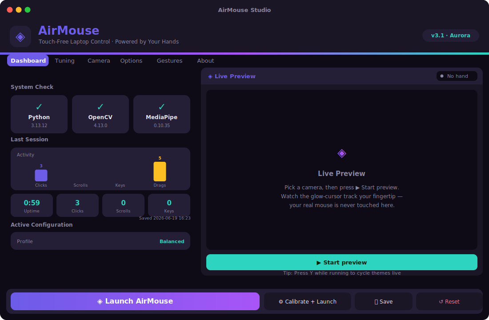
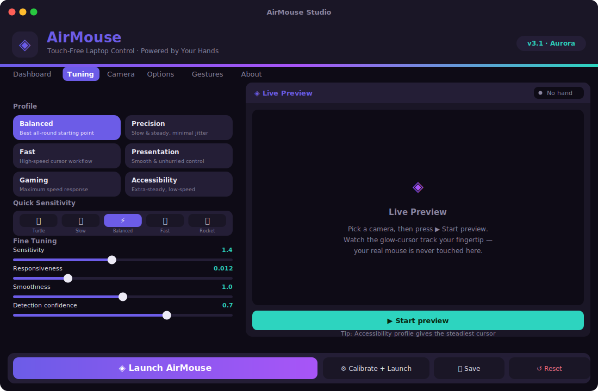
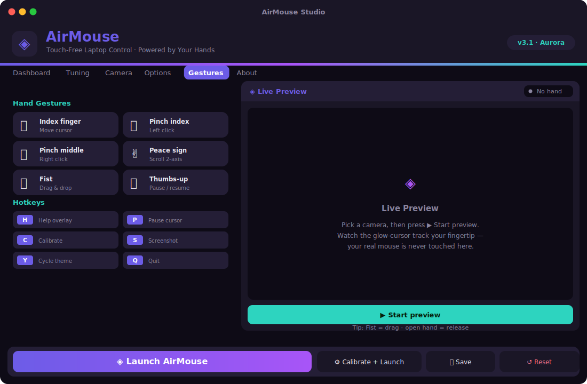
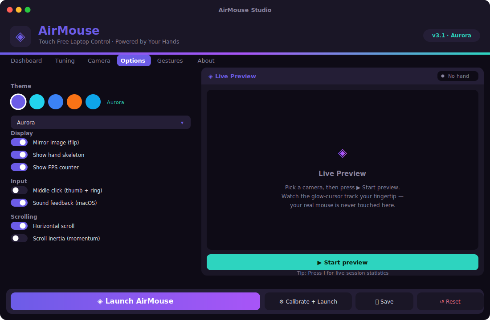

<p align="center">
  
</p>

<h1 align="center">◈ &nbsp;AirMouse &nbsp;3.1</h1>
<h3 align="center">Touch-Free Laptop Control · Powered by Your Hands</h3>

<p align="center">
  Control your laptop entirely in the air — cursor, clicks, scroll, drag &amp; type.<br>
  No touch needed. Just your hand and a webcam.
</p>

<p align="center">
  
  
  
  
  
</p>

---

## Screenshots

<table>
<tr>
  <td align="center"><br><b>Studio · Dashboard</b><br>System check, last-session chart, active config</td>
  <td align="center"><br><b>Studio · Tuning</b><br>Profile cards, quick sensitivity bar, fine sliders</td>
</tr>
<tr>
  <td align="center"><br><b>Studio · Gestures</b><br>Visual gesture &amp; hotkey reference cards</td>
  <td align="center"><br><b>Studio · Options</b><br>Theme swatches, display, input &amp; scroll toggles</td>
</tr>
</table>

---

## ✨ What's New in v3.1

| | |
|---|---|
| 🎨 **Two new themes** | Sunset (amber/red) and Ocean (sky-blue/cyan) join Aurora, Cyber, and Mono |
| 📊 **Dashboard tab** | System check, last-session activity bar chart, quick-stat cards, active config summary |
| 🃏 **Profile cards** | Click-to-activate profile cards replace the old dropdown |
| 🚀 **Quick sensitivity bar** | One-tap preset buttons — 🐢 Turtle → 🦊 Slow → ⚡ Balanced → 🦅 Fast → 🚀 Rocket |
| 🔊 **Sound feedback** | Brief macOS system sounds (afplay) on every gesture click |
| ✌️ **Visual gesture cards** | Icon + name + action in a clean grid under the Gestures tab |
| 🎛️ **Theme swatches** | Coloured circle buttons for one-click theme switching |
| 🔍 **Detection sliders** | Tune detection + tracking confidence directly in the UI |
| 💡 **Rotating tips** | Tips rotate every 6 s in the preview pane |
| ✨ **Richer HUD** | Cursor glow rings (cv2.addWeighted), toast accent bar, gradient header strip |
| 💾 **Session persistence** | Last session saved to `last_session.json` → shown on the Dashboard |
| 🎬 **Animated launch button** | Launch button pulses between primary and secondary colours |
| 🎓 **Guided walkthrough** | First-run, step-by-step onboarding — permissions, gestures, how to launch — with a **? Tutorial** button to replay and a *Don't show again* opt-out |
| 🧭 **In-app coach card** | A getting-started card in the camera window; toggle with `/`, hide forever with `N` |
| 🛰️ **Remote control** | Drive another PC with your hand — server (controller) broadcasts high-level commands to one or many clients, with token auth, `--demo`/`--dry-run` test modes, and a one-click launcher in Studio |

---

## Features

<table>
<tr><td>

**Buttery cursor**<br>
One Euro Filter — smooth when still, instant when you move. No lag, no jitter.

</td><td>

**Click suite**<br>
Left, right, middle (opt-in), and double-click — all with pinch hysteresis.

</td></tr>
<tr><td>

**2-axis scroll**<br>
Peace sign → move hand up/down/left/right. Optional inertia/momentum glide.

</td><td>

**Drag & drop**<br>
Fist to grab, open hand to drop. Works across monitors.

</td></tr>
<tr><td>

**Virtual keyboard**<br>
Hold open palm to toggle. QWERTY + function row + Caps/Shift + live text preview.

</td><td>

**6 tuning profiles**<br>
Balanced · Precision · Fast · Presentation · Gaming · Accessibility

</td></tr>
<tr><td>

**5 colour themes**<br>
Aurora · Cyber · Mono · Sunset · Ocean — recolour GUI + HUD live with `Y`

</td><td>

**AirMouse Studio**<br>
Beautiful two-pane control centre: tune, preview, profile, and launch.

</td></tr>
<tr><td>

**Calibration**<br>
Map your comfortable hand range to the full screen with a 5-second sweep (`C`).

</td><td>

**Client / Server mode**<br>
Stream gestures from one machine to control another on the same LAN.

</td></tr>
</table>

---

## Installation

```bash
git clone https://github.com/at0m-b0mb/AirMouse-Hand-Gesture-Control.git
cd AirMouse-Hand-Gesture-Control
pip install -r requirements.txt
```

> **Core** uses `pynput` + `pyautogui`. **AirMouse Studio** additionally needs `customtkinter` + `Pillow`; they're included in `requirements.txt`.  
> The hand-tracking model (~8 MB) is downloaded automatically on first run.

### macOS permissions (required)

Go to **System Settings → Privacy & Security** and grant:

| Permission | Who needs it |
|---|---|
| **Camera** | Terminal (or your Python interpreter) |
| **Accessibility** | Terminal — needed for mouse/keyboard control |

---

## Usage

### 🖥️ AirMouse Studio — the GUI control centre

```bash
python launcher.py
```

A beautiful two-pane window appears:

**Left pane — 6 tabs**

| Tab | What's here |
|---|---|
| **Dashboard** | System check, last-session bar chart, quick-stat cards, active config |
| **Tuning** | Profile cards, quick-sensitivity bar 🐢→🚀, 8 fine-tuning sliders |
| **Camera** | Scan and pick a specific webcam (or leave on auto-detect) |
| **Options** | Theme swatches/dropdown, display toggles, sound feedback, scrolling, comfort |
| **Gestures** | Visual gesture cards + hotkey badges |
| **About** | What's new, tech stack, repo link |

**Right pane — Live Preview**

Click **▶ Start preview** to see your webcam with the hand skeleton and a *raw-vs-smoothed* glow-cursor dot. Drag any slider and watch tracking respond in real time. Your real mouse is **never touched** during preview.

Hit **◈ Launch AirMouse** (or **Calibrate + Launch**); **Save** writes settings to `config.json` without launching.

---

### ⌨️ Standalone

```bash
python AirMouse.py
```

#### Command-line options

```bash
python AirMouse.py --list-cameras           # show detected cameras and exit
python AirMouse.py --camera 1               # force a specific camera index
python AirMouse.py --calibrate              # run hand-range calibration on startup
python AirMouse.py --no-flip                # disable the mirror flip
python AirMouse.py --sensitivity 1.8        # override cursor sensitivity
python AirMouse.py --profile Precision      # Balanced / Precision / Fast / Presentation / Gaming / Accessibility
python AirMouse.py --theme Sunset           # Aurora / Cyber / Mono / Sunset / Ocean
python AirMouse.py --always-on-top          # keep the window above other windows
python AirMouse.py --middle-click           # enable the thumb+ring middle-click gesture
python AirMouse.py --reset-config           # delete config.json and start fresh
```

---

## Gesture Reference

<table>
<tr><th>Hand pose</th><th>Action</th></tr>
<tr><td>👆 Index finger pointing</td><td>Move cursor</td></tr>
<tr><td>🤌 Pinch thumb + index</td><td>Left click &nbsp;·&nbsp; pinch twice quickly = double-click</td></tr>
<tr><td>🤏 Pinch thumb + middle</td><td>Right click</td></tr>
<tr><td>🖐️ Pinch thumb + ring</td><td>Middle click (opt-in — enable in Options)</td></tr>
<tr><td>✌️ Peace sign</td><td>Scroll — move hand up / down / left / right</td></tr>
<tr><td>✊ Fist</td><td>Drag — fist to grab, open hand to drop</td></tr>
<tr><td>🖐️ Open palm (hold ~1 s)</td><td>Toggle virtual keyboard</td></tr>
<tr><td>👍 Thumbs-up (hold ~0.7 s)</td><td>Pause / resume cursor control</td></tr>
</table>

**In keyboard mode:** your hand moves over a QWERTY overlay in the lower half of the window. Pinch to press the highlighted key. A function row adds arrows, Esc, volume, mute, play/pause, and screenshot. Caps Lock and Shift are supported; a live preview bar shows what you're typing.

---

## New here? Guided walkthrough & help

AirMouse explains itself so you never have to guess what to do:

- **First-run walkthrough** — the first time you open AirMouse Studio, a step-by-step
  guide walks you through granting **Camera + Accessibility** access (with a one-click
  button to open the right macOS settings pane), the core gestures, tuning, and how to
  launch. Tick **Don't show this again** to opt out, or replay it anytime from the
  **? Tutorial** button in the header or **Options → Replay the walkthrough**.
- **In-app coach card** — when the camera window opens, a compact *Getting Started*
  card shows the key gestures and how to reach the full guide. It auto-hides after a few
  seconds. Press `/` to show/hide it, or `N` to never show it again. (Re-enable both from
  **Studio → Options → Guidance**.)

Everything is opt-out and remembered in `config.json`, so power users never see it twice.

---

## Hotkeys (while running)

| Key | Action | Key | Action |
|---|---|---|---|
| `H` | Toggle help overlay | `S` | Screenshot |
| `/` | Show / hide tips card | `N` | Never show tips again |
| `P` / `Space` | Pause / freeze cursor | `C` | Calibrate hand range |
| `L` | Toggle hand skeleton | `G` / `I` | Toggle FPS / stats |
| `Y` | Cycle theme live | `T` | Toggle always-on-top |
| `F` | Toggle mirror flip | `+` / `−` | Sensitivity up / down |
| `[` / `]` | Smoothing softer / snappier | `Q` / `ESC` | Quit (saves settings) |

---

## Tuning Profiles

One-click presets — switch in Studio or via `--profile`:

| Profile | Best for |
|---|---|
| ⚡ **Balanced** | Everyday use (default) |
| 🎯 **Precision** | Fine, deliberate pointing — slower & smoother |
| 🦅 **Fast** | Big screens / quick navigation |
| 📊 **Presentation** | Pointing while presenting — steady, relaxed clicks |
| 🎮 **Gaming** | Maximum speed & reach |
| ♿ **Accessibility** | Extra-smooth & forgiving — slow, large dead zone |

Moving any slider switches the profile to **Custom**.

---

## Themes

Five built-in colour schemes recolour the **entire GUI and the in-app HUD**:

| Theme | Vibe | Primary | Accent |
|---|---|---|---|
| 🌌 **Aurora** | Indigo → violet → teal (default) | `#6C5CE7` | `#2DD4BF` |
| 💻 **Cyber** | Neon cyan + magenta on near-black | `#00FFFF` | `#FF00FF` |
| 🖤 **Mono** | Clean charcoal + steel blue | `#60A5FA` | `#93C5FD` |
| 🌅 **Sunset** | Warm amber → fire red | `#F97316` | `#FDE68A` |
| 🌊 **Ocean** | Sky blue → cyan | `#0EA5E9` | `#67E8F9` |

Switch in Studio → Options, with `--theme`, or live with `Y` while running.

---

## Calibration

By default AirMouse maps the central ~76% of the camera frame to your full screen. For a perfect fit to *your* reach:

1. Press `C` (or use **Calibrate + Launch** in Studio, or `--calibrate` CLI flag).
2. For ~5 seconds, sweep your index finger to the **four corners** of your comfortable range.
3. The bounding box is saved to `config.json` and used for all future cursor mapping.

---

## Remote control — one hand, another computer

Use your hand on one machine to drive the mouse on another over your LAN.
The roles are simple: **the server is the controller** (it has your webcam), and
**the client is the machine being controlled** (no camera needed). One server can
control **several clients at once**.

```bash
# 1) On YOUR machine (the webcam) — the controller:
python AirMouse_Server.py --token mysecret

#    It prints your LAN IP and the exact command to run on the other PC.

# 2) On the machine you want to CONTROL — the client:
python AirMouse_Client.py <server_ip> --token mysecret
```

Or just open **AirMouse Studio → Options → Remote Control** and click
**🛰 Start control server** — it shows this PC's IP and the client command for you.

### What travels the wire

The controller does all the hand-tracking and sends ready-made, high-level
**commands** — `move`, `click` (left/right/middle), `double-click`, `scroll`,
`drag` — as fixed-size `struct` frames. **No `pickle`, ever**, so a malicious peer
can't run code on you. Cursor moves are sent as 0–1 fractions, so any screen size
drives any other.

| Flag | Side | What it does |
|---|---|---|
| `--token <secret>` | both | Shared secret; clients with the wrong token are rejected |
| `--demo` | server | No camera — broadcast a test pattern (great first check) |
| `--no-window` | server | Run the controller headless |
| `--dry-run` | client | Print commands without moving the mouse (safe test) |
| `--retry` | client | Auto-reconnect with backoff if the link drops |
| `--port <n>` | both | Use a custom port (default `12345`) |

**Safety:** being a client means another machine can move your mouse — only
connect to a server you trust, always set a `--token`, and press **Esc** on the
client (or `Ctrl-C`) to stop instantly. Try `--demo` + `--dry-run` first to verify
the link end-to-end before any real control happens.

---

## Configuration

`config.json` is auto-created on first run. Key options:

| Key | Default | Description |
|---|---|---|
| `camera_index` | −1 | Webcam index; −1 = auto-detect |
| `oe_min_cutoff` | 1.0 | Lower → smoother when still |
| `oe_beta` | 0.012 | Higher → snappier when moving fast |
| `sensitivity` | 1.4 | Cursor speed multiplier |
| `cursor_margin` | 0.12 | Edge fraction ignored when not calibrated |
| `click_threshold` | 0.055 | Pinch distance to engage click |
| `click_release` | 0.085 | Pinch distance to release (hysteresis) |
| `double_click_window` | 0.40 | Window (s) for double-click detection |
| `scroll_speed` | 4 | Scroll magnitude |
| `horizontal_scroll` | true | Left/right scroll in peace gesture |
| `scroll_inertia` | false | Momentum glide after scroll gesture |
| `keyboard_toggle_hold` | 0.9 | Open-palm hold (s) to toggle keyboard |
| `pause_toggle_hold` | 0.7 | Thumbs-up hold (s) to pause/resume |
| `profile` | Balanced | Active tuning profile |
| `theme` | Aurora | Visual theme |
| `enable_middle_click` | false | Thumb+ring → middle click |
| `idle_pause_secs` | 0 | Auto-pause after N seconds with no hand |
| `sound_feedback` | false | Play click sounds on gesture events (macOS) |
| `always_on_top` | false | Keep the AirMouse window above others |
| `show_stats` | false | Live session-stats line in the HUD |
| `show_tutorial` | true | Show the Studio walkthrough on launch |
| `coach_overlay` | true | Show the first-run coach card in the camera window |
| `flip` | true | Mirror the camera image |

---

## Architecture

```
AirMouse.py              CLI entry point — parses args, builds Config, runs the app
launcher.py              AirMouse Studio — customtkinter GUI control centre + live preview
AirMouse_Server.py       Controller: tracks your hand, broadcasts commands to clients
AirMouse_Client.py       Controlled: applies received commands to this machine's mouse
config.py                Config dataclass + tuning PROFILES + JSON persistence
assets/                  Brand vector logo & README banner (SVG)
src/
  app.py                 AirMouseApp — camera loop, gesture dispatch, HUD, hotkeys
  branding.py            App identity + THEMES (GUI hex + HUD BGR, single source of truth)
  stats.py               SessionStats — clicks/scrolls/keys/cursor-travel + file persistence
  filters.py             One Euro Filter for low-latency cursor smoothing
  camera.py              Camera probing, auto-detect, warm-up, resolution targeting
  hand_tracker.py        MediaPipe HandLandmarker (Tasks API) — auto-downloads model
  gesture.py             Classify 21 landmarks → Gesture enum (edge-triggered clicks)
  mouse.py               pynput mouse/keyboard + One Euro filtering + scroll inertia
  actions.py             System actions: volume, media, screenshots, special keys, afplay
  virtual_keyboard.py    QWERTY + function-row overlay with Caps/Shift + live text preview
  hud.py                 Themed status bar, help overlay, ripples, toasts, calibration screen
  link_protocol.py       Safe struct command protocol + token handshake for remote control
```

---

## Troubleshooting

**Cursor won't move / clicks don't fire**
→ Grant **Accessibility** to Terminal in System Settings → Privacy & Security → Accessibility.

**Camera not found**
→ `python AirMouse.py --list-cameras`, then `--camera N` with a listed index.

**Model download fails / `CERTIFICATE_VERIFY_FAILED`**
→ A macOS Python SSL quirk (no CA bundle). AirMouse downloads via `certifi`; `pip install -r requirements.txt` usually fixes it. If not:
```bash
curl -fL -o hand_landmarker.task \
  "https://storage.googleapis.com/mediapipe-models/hand_landmarker/hand_landmarker/float16/latest/hand_landmarker.task"
```

**Jittery cursor**
→ Press `[` a few times (softer smoothing), or lower `oe_beta` in config. Ensure good lighting.

**Cursor doesn't reach screen edges**
→ Calibrate with `C`, or lower `cursor_margin`, or raise sensitivity with `+`.

**Accidental clicks**
→ Raise `click_threshold` slightly, or increase `click_cooldown` in `config.json`.

---

## Requirements

- Python 3.10 +
- Webcam
- macOS · Linux · Windows

---

## License

MIT — free for educational and personal use.

---

<p align="center">Created and maintained by <a href="https://github.com/at0m-b0mb"><b>at0m-b0mb</b></a></p>
