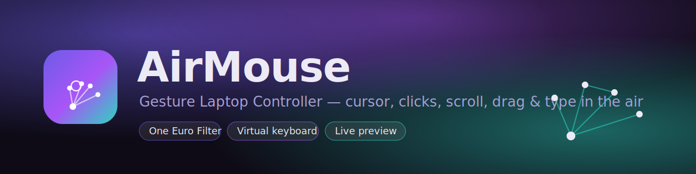

<p align="center">
  
</p>

<p align="center">
  <b>Control your laptop entirely with your hand</b> — no keyboard, no mouse, no touchpad.<br>
  AirMouse turns your webcam + real-time hand tracking into precise cursor movement,
  clicks, scrolling, dragging, and typing — with a beautiful tunable control center.
</p>

<p align="center">
  
  
  
  
</p>

---

## Features

| Feature | Description |
|---|---|
| **Buttery cursor** | One Euro Filter — smooth when still, instant when you move (no lag, no jitter) |
| **Left / right click** | Pinch thumb+index (left) or thumb+middle (right), edge-triggered with hysteresis |
| **Middle click** | Optional thumb+ring pinch (enable in the GUI, `--middle-click`, or config) |
| **Double-click** | Pinch thumb+index twice quickly |
| **Scroll (2-axis)** | Peace sign — move hand up/down and left/right |
| **Drag** | Fist to grab, open hand to release |
| **Virtual keyboard** | Hold open palm to toggle; pinch keys to type; live text preview, Caps & Shift |
| **Function keys** | Volume, mute, play/pause, screenshot, arrows & Esc — built into the keyboard |
| **Pause / freeze** | Thumbs-up (hold) or `P` to pause; `Space` to freeze the cursor in place |
| **Tuning profiles** | One-click **Balanced · Precision · Fast · Presentation · Gaming · Accessibility** |
| **Themes** | **Aurora · Cyber · Mono** — recolours the whole GUI + HUD (`Y` to cycle live) |
| **Live GUI preview** | AirMouse Studio shows your webcam + tracking + a raw-vs-smoothed cursor dot while you tune |
| **Scroll inertia** | Optional momentum glide after a scroll gesture, like a trackpad |
| **Idle auto-pause** | Optionally pause after N seconds with no hand in frame |
| **Session stats** | Live count of clicks, scrolls, keys & cursor travel (`I`) |
| **Calibration** | Press `C` — map *your* comfortable hand range to the full screen |
| **Auto camera** | Scans all ports on first run, saves the working index to config.json |
| **Always-on-top** | Keep the AirMouse window above everything (`T`, `--always-on-top`, GUI) |
| **Rich themed HUD** | Mode badge, FPS, gesture labels, click ripples, toasts, in-app help (`H`) |
| **AirMouse Studio** | `launcher.py` — two-pane control center with a live preview, profiles, themes & sliders |
| **Client/Server** | Stream gestures from one machine to control another on the same network |

---

## Gesture Reference

```
Hand pose                   Action
──────────────────────────  ────────────────────────────────────
Index finger pointing       Move cursor
Pinch thumb + index         Left click   (pinch twice fast = double-click)
Pinch thumb + middle        Right click
Pinch thumb + ring          Middle click  (opt-in — enable in Options/--middle-click)
Index + middle up (peace)   Scroll — move hand up/down, left/right
Fist (all fingers curled)   Drag — fist to grab, open to drop
Open palm, hold ~1 s        Toggle virtual keyboard
Thumbs-up, hold ~0.7 s      Pause / resume control
```

**In keyboard mode:** your hand moves a cursor over the on-screen QWERTY layout (lower half of the window). Pinch to press the highlighted key. A function row adds **arrows, Esc, volume, mute, play/pause, and screenshot**. `Caps` and `⇧ Shift` are supported; a live preview bar shows what you're typing.

---

## Hotkeys (while running)

| Key | Action | Key | Action |
|---|---|---|---|
| `H` | Toggle help overlay | `S` | Screenshot |
| `P` | Pause / resume | `Space` | Freeze / unfreeze cursor |
| `C` | Calibrate hand range | `L` | Toggle hand skeleton |
| `G` | Toggle FPS counter | `I` | Toggle session stats |
| `Y` | Cycle theme | `T` | Toggle always-on-top |
| `F` | Toggle mirror flip | `+` / `-` | Sensitivity up / down |
| `[` / `]` | Smoothing softer / snappier | `Q` / `ESC` | Quit (saves settings) |

---

## Installation

```bash
git clone https://github.com/at0m-b0mb/AirMouse-Hand-Gesture-Control.git
cd AirMouse-Hand-Gesture-Control
pip install -r requirements.txt
```

> Core control uses `pynput` (with a `pyautogui` fallback). `customtkinter` + `pillow` are only needed for **AirMouse Studio** (the GUI + live preview) — the standalone `AirMouse.py` runs without them.

### macOS permissions (required)

Grant both in **System Settings → Privacy & Security**:
- **Camera** → Terminal (or your Python interpreter)
- **Accessibility** → Terminal (needed for mouse/keyboard control)

---

## Usage

### AirMouse Studio — the GUI control center (easiest)

```bash
python launcher.py
```
A beautiful two-pane control center (needs `customtkinter` + `pillow`):

- **Left — controls**
  - **Tuning** — pick a profile or fine-tune sensitivity, responsiveness, smoothness, edge margin, scroll speed & click sensitivity with live sliders
  - **Camera** — scan for and pick a specific webcam (or leave on auto-detect)
  - **Options** — theme picker, mirror, skeleton, help, FPS, stats, always-on-top, middle-click, horizontal scroll, scroll inertia, and idle auto-pause
  - **Gestures** — full gesture & hotkey cheat-sheet
  - **About** — version & repo link
- **Right — live preview** — press **Start preview** to see your webcam with the hand skeleton and a *raw-vs-smoothed* cursor dot. Drag the Responsiveness / Smoothness sliders and watch the smoothing change in real time. **Your real mouse is never touched in preview**, so it's a safe place to dial things in.

Hit **Launch** (or **Calibrate + launch**); **Save** writes settings to `config.json` without launching.

### Standalone

```bash
python AirMouse.py
```
On first run the hand-tracking model (~8 MB) is downloaded automatically and the camera index is saved to `config.json`.

#### Command-line options

```bash
python AirMouse.py --list-cameras      # show detected cameras and exit
python AirMouse.py --camera 1          # force a specific camera index
python AirMouse.py --calibrate         # run hand-range calibration on startup
python AirMouse.py --no-flip           # disable the mirror flip
python AirMouse.py --sensitivity 1.8   # override cursor sensitivity
python AirMouse.py --profile Precision # tuning profile (Balanced/Precision/Fast/Presentation/Gaming/Accessibility)
python AirMouse.py --theme Cyber       # visual theme (Aurora/Cyber/Mono)
python AirMouse.py --always-on-top     # keep the window above other windows
python AirMouse.py --middle-click      # enable the thumb+ring middle-click gesture
python AirMouse.py --reset-config      # delete config.json and start fresh
```

### Tuning profiles

Switch the cursor "feel" in one move — from Studio's **Tuning** tab or the CLI:

| Profile | Best for |
|---|---|
| **Balanced** | Everyday use (default) |
| **Precision** | Fine, deliberate pointing — slower & smoother |
| **Fast** | Big screens / quick navigation — snappier & faster |
| **Presentation** | Pointing while presenting — steady with relaxed clicks |
| **Gaming** | Maximum speed & reach |
| **Accessibility** | Very smooth & forgiving — slow, large dead zone |

A profile only changes the tuning sliders; your camera, calibration and toggles are left untouched. Moving any slider switches the profile to **Custom**.

### Themes

Three built-in looks recolour the entire GUI **and** the in-app HUD:

| Theme | Vibe |
|---|---|
| **Aurora** | Indigo → violet → teal (default) |
| **Cyber** | Neon cyan + magenta on near-black |
| **Mono** | Clean charcoal with a single blue accent |

Switch in Studio's **Options** tab, with `--theme`, or live with `Y` while running.

### Client / Server mode (two machines on the same network)

Run on the machine you want to **control** (the server):
```bash
python AirMouse_Server.py
```
Run on the machine with the **camera** (the client):
```bash
python AirMouse_Client.py <server_ip>
```

---

## Calibration

By default AirMouse maps the central ~76% of the camera frame to your full screen. For a perfect fit to *your* reach:

1. Press `C` (or launch with `--calibrate`, or use the launcher's "Calibrate then launch").
2. For 5 seconds, move your hand to the **four corners** of your comfortable range.
3. The box is saved to `config.json` and used for cursor mapping from then on.

---

## Configuration

`config.json` is auto-created on first run. Key options:

| Key | Default | Description |
|---|---|---|
| `camera_index` | auto | Webcam index; set manually if auto-detection is wrong |
| `use_one_euro` | true | Use the One Euro Filter (recommended) instead of plain EMA |
| `oe_min_cutoff` | 1.0 | Lower → smoother when the hand is still |
| `oe_beta` | 0.012 | Higher → snappier when the hand moves fast |
| `sensitivity` | 1.4 | Cursor speed multiplier |
| `cursor_margin` | 0.12 | Edge fraction ignored when not calibrated |
| `click_threshold` / `click_release` | 0.055 / 0.085 | Pinch engage / release distances (hysteresis) |
| `double_click_window` | 0.40 | Seconds within which two clicks become a double-click |
| `scroll_speed` | 4 | Scroll magnitude |
| `horizontal_scroll` | true | Enable left/right scroll in the peace gesture |
| `keyboard_toggle_hold` | 0.9 | Open-palm seconds to toggle the keyboard |
| `pause_toggle_hold` | 0.7 | Thumbs-up seconds to pause/resume |
| `profile` | Balanced | Active tuning profile (or `Custom`) |
| `theme` | Aurora | Visual theme (`Aurora` / `Cyber` / `Mono`) |
| `enable_middle_click` | false | Thumb+ring pinch → middle click |
| `scroll_inertia` / `scroll_friction` | false / 0.85 | Momentum glide after scrolling + its decay |
| `idle_pause_secs` | 0 | Auto-pause after N seconds with no hand (0 = off) |
| `show_stats` | false | Show the live session-stats line in the HUD |
| `always_on_top` | false | Keep the AirMouse window above other windows |
| `flip` | true | Mirror the camera image |
| `screenshot_dir` | screenshots | Where `S` / the screenshot key saves PNGs |

Many of these can also be changed live with hotkeys and are saved on exit.

---

## Architecture

```
AirMouse.py              Thin CLI entry point — parses args, builds Config, runs the app
launcher.py              AirMouse Studio — the customtkinter GUI control center + live preview
AirMouse_Client.py       Client: streams landmark data to the server (safe struct protocol)
AirMouse_Server.py       Server: drives the mouse from streamed landmark data
config.py                Config dataclass + tuning PROFILES + JSON persistence (config.json)
assets/                  Brand vector logo & README banner (SVG)
src/
  app.py                 AirMouseApp — camera loop, gesture dispatch, HUD, hotkeys
  branding.py            App identity + colour THEMES (one source of truth: GUI hex + HUD BGR)
  stats.py               SessionStats — clicks/scrolls/keys/cursor-travel tracking
  filters.py             One Euro Filter for low-latency cursor smoothing
  camera.py              Camera probing, auto-detect, warm-up, open at target resolution
  hand_tracker.py        MediaPipe HandLandmarker (Tasks API) — auto-downloads model
  gesture.py             Classify 21 landmarks → Gesture enum (edge-triggered clicks)
  mouse.py               pynput mouse/keyboard with One Euro filtering + scroll inertia
  actions.py             System actions: volume, media, screenshots, special keys
  virtual_keyboard.py    QWERTY + function-row overlay with live text preview
  hud.py                 Themed status bar, help overlay, ripples, toasts, stats, calibration
```

---

## Troubleshooting

**Cursor won't move / clicks don't fire** → Grant Accessibility to Terminal in System Settings → Privacy & Security → Accessibility.

**Camera not found** → `python AirMouse.py --list-cameras`, then `--camera N` with a listed index.

**Jittery cursor** → Press `[` a few times (softer smoothing), or lower `oe_beta` in config. Ensure good lighting.

**Cursor doesn't reach screen edges** → Calibrate with `C`, or lower `cursor_margin`, or raise sensitivity with `+`.

**Accidental clicks** → Raise `click_threshold` slightly, or increase `click_cooldown`.

---

## Requirements

- Python 3.10+
- Webcam
- macOS / Linux / Windows

---

## License

MIT — educational and personal use.

---

Created and maintained by [**at0m-b0mb**](https://github.com/at0m-b0mb).
