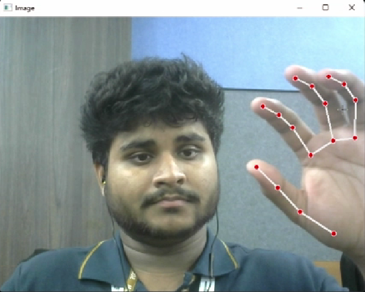

# AirMouse — Hand Gesture Control

Control your laptop **entirely with your hand** — no keyboard, no mouse, no touchpad. AirMouse uses your webcam and real-time hand tracking (MediaPipe) to turn gestures into precise cursor movement, clicks, scrolling, dragging, and typing through an on-screen virtual keyboard.

[](demo/AirMouse_Demo.mp4)

---

## Features

| Feature | Description |
|---|---|
| **Buttery cursor** | One Euro Filter — smooth when still, instant when you move (no lag, no jitter) |
| **Left / right click** | Pinch thumb+index (left) or thumb+middle (right), edge-triggered with hysteresis |
| **Double-click** | Pinch thumb+index twice quickly |
| **Scroll (2-axis)** | Peace sign — move hand up/down and left/right |
| **Drag** | Fist to grab, open hand to release |
| **Virtual keyboard** | Hold open palm to toggle; pinch keys to type; live text preview, Caps & Shift |
| **Function keys** | Volume, mute, play/pause, screenshot, arrows & Esc — built into the keyboard |
| **Pause / resume** | Thumbs-up (hold) or press `P` — rest your hand without moving the cursor |
| **Calibration** | Press `C` — map *your* comfortable hand range to the full screen |
| **Auto camera** | Scans all ports on first run, saves the working index to config.json |
| **Full-screen mapping** | Detects screen resolution; calibration or margin maps frame → whole display |
| **Live tuning** | Adjust sensitivity & smoothing on the fly with hotkeys |
| **Rich HUD** | Mode badge, FPS, gesture labels, click ripples, toasts, in-app help (`H`) |
| **GUI launcher** | `launcher.py` — pick camera & tune with sliders before launching |
| **Client/Server** | Stream gestures from one machine to control another on the same network |

---

## Gesture Reference

```
Hand pose                   Action
──────────────────────────  ────────────────────────────────────
Index finger pointing       Move cursor
Pinch thumb + index         Left click   (pinch twice fast = double-click)
Pinch thumb + middle        Right click
Index + middle up (peace)   Scroll — move hand up/down, left/right
Fist (all fingers curled)   Drag — fist to grab, open to drop
Open palm, hold ~1 s        Toggle virtual keyboard
Thumbs-up, hold ~0.7 s      Pause / resume control
```

**In keyboard mode:** your hand moves a cursor over the on-screen QWERTY layout (lower half of the window). Pinch to press the highlighted key. A function row adds **arrows, Esc, volume, mute, play/pause, and screenshot**. `Caps` and `⇧ Shift` are supported; a live preview bar shows what you're typing.

---

## Hotkeys (while running)

| Key | Action | Key | Action |
|---|---|---|---|
| `H` | Toggle help overlay | `S` | Screenshot |
| `P` | Pause / resume | `L` | Toggle hand skeleton |
| `C` | Calibrate hand range | `F` | Toggle mirror flip |
| `+` / `-` | Sensitivity up / down | `[` / `]` | Smoothing softer / snappier |
| `Q` / `ESC` | Quit (saves settings) | | |

---

## Installation

```bash
git clone https://github.com/at0m-b0mb/AirMouse-Hand-Gesture-Control.git
cd AirMouse-Hand-Gesture-Control
pip install -r requirements.txt
```

> The old `autopy` dependency has been replaced with `pynput`. `customtkinter` is optional (only for the GUI launcher).

### macOS permissions (required)

Grant both in **System Settings → Privacy & Security**:
- **Camera** → Terminal (or your Python interpreter)
- **Accessibility** → Terminal (needed for mouse/keyboard control)

---

## Usage

### GUI launcher (easiest)

```bash
python launcher.py
```
Pick your camera, drag the sliders, and hit **Launch**.

### Standalone

```bash
python AirMouse.py
```
On first run the hand-tracking model (~8 MB) is downloaded automatically and the camera index is saved to `config.json`.

#### Command-line options

```bash
python AirMouse.py --list-cameras      # show detected cameras and exit
python AirMouse.py --camera 1          # force a specific camera index
python AirMouse.py --calibrate         # run hand-range calibration on startup
python AirMouse.py --no-flip           # disable the mirror flip
python AirMouse.py --sensitivity 1.8   # override cursor sensitivity
python AirMouse.py --reset-config      # delete config.json and start fresh
```

### Client / Server mode (two machines on the same network)

Run on the machine you want to **control** (the server):
```bash
python AirMouse_Server.py
```
Run on the machine with the **camera** (the client):
```bash
python AirMouse_Client.py <server_ip>
```

---

## Calibration

By default AirMouse maps the central ~76% of the camera frame to your full screen. For a perfect fit to *your* reach:

1. Press `C` (or launch with `--calibrate`, or use the launcher's "Calibrate then launch").
2. For 5 seconds, move your hand to the **four corners** of your comfortable range.
3. The box is saved to `config.json` and used for cursor mapping from then on.

---

## Configuration

`config.json` is auto-created on first run. Key options:

| Key | Default | Description |
|---|---|---|
| `camera_index` | auto | Webcam index; set manually if auto-detection is wrong |
| `use_one_euro` | true | Use the One Euro Filter (recommended) instead of plain EMA |
| `oe_min_cutoff` | 1.0 | Lower → smoother when the hand is still |
| `oe_beta` | 0.012 | Higher → snappier when the hand moves fast |
| `sensitivity` | 1.4 | Cursor speed multiplier |
| `cursor_margin` | 0.12 | Edge fraction ignored when not calibrated |
| `click_threshold` / `click_release` | 0.055 / 0.085 | Pinch engage / release distances (hysteresis) |
| `double_click_window` | 0.40 | Seconds within which two clicks become a double-click |
| `scroll_speed` | 4 | Scroll magnitude |
| `horizontal_scroll` | true | Enable left/right scroll in the peace gesture |
| `keyboard_toggle_hold` | 0.9 | Open-palm seconds to toggle the keyboard |
| `pause_toggle_hold` | 0.7 | Thumbs-up seconds to pause/resume |
| `flip` | true | Mirror the camera image |
| `screenshot_dir` | screenshots | Where `S` / the screenshot key saves PNGs |

Many of these can also be changed live with hotkeys and are saved on exit.

---

## Architecture

```
AirMouse.py              Standalone entry point — CLI, main loop, hotkeys, calibration
launcher.py              Optional customtkinter GUI launcher
AirMouse_Client.py       Client: streams landmark data to the server (safe struct protocol)
AirMouse_Server.py       Server: drives the mouse from streamed landmark data
config.py                Config dataclass + JSON persistence (config.json)
src/
  filters.py             One Euro Filter for low-latency cursor smoothing
  camera.py              Camera probing, auto-detect, warm-up, open at target resolution
  hand_tracker.py        MediaPipe HandLandmarker (Tasks API) — auto-downloads model
  gesture.py             Classify 21 landmarks → Gesture enum (edge-triggered clicks)
  mouse.py               pynput mouse/keyboard with One Euro filtering; pyautogui fallback
  actions.py             System actions: volume, media, screenshots, special keys
  virtual_keyboard.py    QWERTY + function-row overlay with live text preview
  hud.py                 Status bar, help overlay, click ripples, toasts, calibration UI
```

---

## Troubleshooting

**Cursor won't move / clicks don't fire** → Grant Accessibility to Terminal in System Settings → Privacy & Security → Accessibility.

**Camera not found** → `python AirMouse.py --list-cameras`, then `--camera N` with a listed index.

**Jittery cursor** → Press `[` a few times (softer smoothing), or lower `oe_beta` in config. Ensure good lighting.

**Cursor doesn't reach screen edges** → Calibrate with `C`, or lower `cursor_margin`, or raise sensitivity with `+`.

**Accidental clicks** → Raise `click_threshold` slightly, or increase `click_cooldown`.

---

## Requirements

- Python 3.10+
- Webcam
- macOS / Linux / Windows

---

## License

MIT — educational and personal use.
